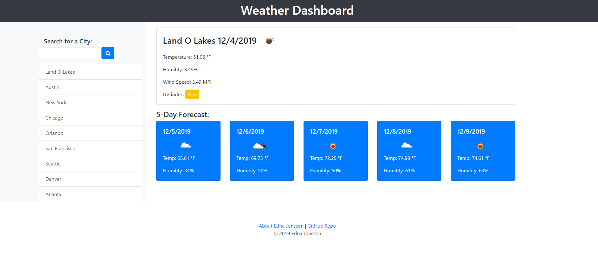

# Weather Forecast

Utilizing the [Open Weather map API](https://openweathermap.org/) I have created an app that gets todays forecast as well as a 5 day forecast.

I utilized Geolocation to get the users city for the initial page load, if the Geolocation is not available or activated, there is a generic search term and the user can use 
the input form to enter a city and search for it.

I used Bootstrap to create the cards with the information and have organized my code so that it is easy to understand that each level in the card must be appended (added) in the correct order. This ensures that the cards are put in the right order for Bootstrap `row > col > card > card-body > card-title > card-text`.

There are 5 ajax functions being used, UV information is unique because it requires latitude and longitude and does not have an option for using city. The Daily Forecast and 5 Day Forecast function are both available by city or lon/lat, and so I have different functions for each of those depending on the parameter for the URL.

I use local storage to add the history of the users search inside the daily forecast function and then have an onclick for the list items to run the function based on which history item the user would like to search.

